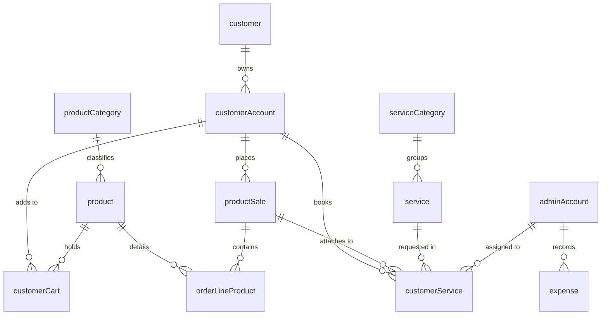

# PedalWorks Dynamics: Bicycle Shop Management System

[](https://www.php.net/)
[](https://www.mysql.com/)
[](https://getbootstrap.com/)
[](https://www.apachefriends.org/)
[](https://www.tup.edu.ph/)

An integrated e-commerce, inventory, service booking, and business operations management platform engineered for modern bicycle retail and repair shops. Developed for the Information Management curriculum (**BSIT-2B-T**) at the **Technological University of the Philippines – Taguig**.

---

## Table of Contents
- [Project Overview](#project-overview)
- [Key Features](#key-features)
  - [Customer Storefront](#customer-storefront)
  - [Administrative Management Suite](#administrative-management-suite)
  - [Role-Based Access Control (RBAC)](#role-based-access-control-rbac)
  - [Data Integrity & SCD Type 2 Price Tracking](#data-integrity--scd-type-2-price-tracking)
- [System Architecture & Tech Stack](#system-architecture--tech-stack)
- [Directory Structure](#directory-structure)
- [Database Schema](#database-schema)
- [Installation & Setup](#installation--setup)
- [Default Seed Accounts](#default-seed-accounts)
- [Security & Design Considerations](#security--design-considerations)
- [License & Academic Credits](#license--academic-credits)

---

## Project Overview

**PedalWorks Dynamics** addresses the operational friction points of specialty bicycle dealerships. Rather than treating products and workshop services as separate silos, this system unifies:
1. **Public Storefront**: Responsive browsing for custom road bikes, MTBs, gravel rigs, commuter cycles, frame components, and workshop service tiers.
2. **Back-Office Management**: Centralized console for stock control, low-inventory notifications, pricing revision histories, technician dispatching, customer account records, and staff access roles.
3. **Historical Price Integrity**: Implementation of Slowly Changing Dimensions (SCD Type 2) guaranteeing that price changes on bicycles or repair labor never distort historical sales records or financial reporting.

---

## Key Features

### Customer Storefront
- **Modern Responsive Design**: Multi-layered outdoor adventure theme combining topographic accents with glassmorphism elements and Bootstrap 5 responsiveness.
- **Dynamic Catalog Browsing**: Real-time filtering and keyword searching across 36 preloaded products and 9 subcategories (Road, Mountain, Gravel, Mamachari, Folding, Kids, Fixies, BMX, and Frames).
- **Service Package Catalog**: Clear presentation of workshop maintenance tiers (Overhauls, Brake Bleeds, Parts Installation, Bike Assembly, and Custom Painting).
- **Stock Availability Badges**: Live indicators alerting buyers when an item is *In Stock*, *Low Stock*, or *Sold Out*.
- **Customer Authentication**: Secure sign-up and login pipelines using standard bcrypt password hashing.

### Administrative Management Suite
- **Management Dashboard (`admin/dashboard.php`)**:
  - Top-level operational metrics: Active Catalog Count, Workshop Packages, Registered Customers, and Staff Total.
  - Automatic low-stock banner linking directly to immediate replenishment tools.
  - Role-aware module cards with dynamic permissions and status badges.
- **Product & Inventory Management (`admin/product/`)**:
  - Comprehensive CRUD operations with image asset uploads and preview validation.
  - Configurable low-stock alert limits per SKU (`lowStockThreshold`).
  - **Stock Adjustment Tool (`stockUpdate.php`)**: Supports three distinct inventory operations:
    - **Restock (+)**: Inbound vendor shipments.
    - **Dispatch (-)**: Damage, shrinkage, or floor transfers.
    - **Physical Audit (=)**: Direct stock level overrides after floor counting.
  - **Safety Deletion Guards**: Deactivation/archiving protection preventing deletion of products tied to past sales orders.
- **Workshop Service Management (`admin/service/`)**:
  - Full CRUD for service packages with category categorization, scope documentation, and labor fees.
  - Real-time usage indicators reflecting historical service bookings.
- **Customer Account Administration (`admin/customerAccount/`)**:
  - Staff management of registered customer identities, contact numbers, delivery addresses, and account status states (`Active`, `Inactive`, `Disabled`).
- **Staff Identity Management (`admin/adminAccount/`)**:
  - Multi-tier administrator account creation, profile editing, and role assignment.

### Role-Based Access Control (RBAC)

The administrative side enforces granular, role-based authorization via centralized guards ([`includes/admin_auth.php`](includes/admin_auth.php)) and dynamic navbar filtering ([`includes/admin_nav.php`](includes/admin_nav.php)):

| Role | Module Access | Description & Scope |
| :--- | :--- | :--- |
| **Super Administrator** | **Full Access (All Modules)** | Unrestricted control over all system operations, staff roles, and audit capabilities. |
| **Inventory Manager** | **Products & Stock Management** | Catalog CRUD, stock level updates, reorder limits, and product archiving. |
| **Service & Repair Manager** | **Workshop Services Management** | Service package creation, labor rate revisions, and repair job coordination. |
| **Accounting Administrator** | **Customers & Financial Overhead** | Customer profile auditing, operational expense tracking, and accounting metrics. |

*Unauthorized page access attempts trigger immediate alerts and safety redirects back to the dashboard.*

### Data Integrity & SCD Type 2 Price Tracking

Bicycle parts and labor rates fluctuate frequently. To maintain historical accounting accuracy, **PedalWorks Dynamics** uses **Slowly Changing Dimensions (SCD Type 2)**:
- Whenever a product price or service fee is updated, the active record is closed by setting `endDate = NOW()`.
- A new record is inserted with the updated price, starting at `startDate = NOW()`, preserving the original SKU and available stock.
- Past sales orders (`orderLineProduct`) link to historical `productID` snapshots, ensuring invoices and past ledger entries never change when catalog prices are altered.

---

## System Architecture & Tech Stack

```
   ┌─────────────────────────────────────────────────────────┐
   │                     Client Browser                      │
   └───────────────┬─────────────────────────┬───────────────┘
                   │ Storefront Requests     │ Admin Requests
                   ▼                         ▼
   ┌─────────────────────────────┐  ┌─────────────────────────────┐
   │ Storefront (Public / User)  │  │ Admin Suite (RBAC Protected)│
   │  - index.php / products.php │  │  - admin/dashboard.php      │
   │  - services.php / login.php │  │  - includes/admin_auth.php  │
   └───────────────┬─────────────┘  └────────┬────────────────────┘
                   │                         │
                   ▼                         ▼
   ┌─────────────────────────────────────────────────────────┐
   │               PHP 8.x Application Backend               │
   │  - Config & Database Connection (includes/config.php)   │
   │  - Session Handling & Password Security (bcrypt)        │
   │  - SQL Prepared Statements (Prepared MySQLi API)        │
   └─────────────────────────────┬───────────────────────────┘
                                 │
                                 ▼
   ┌─────────────────────────────────────────────────────────┐
   │              MySQL Database (pedalworks_db)             │
   │  - InnoDB Storage Engine (Foreign Keys, Constraints)    │
   │  - Generated Virtual Columns (`isCurrent` via IF/STORED)│
   │  - Historical Pricing & Version Chains (SCD Type 2)     │
   └─────────────────────────────────────────────────────────┘
```

- **Server Environment**: Apache / MySQL (XAMPP 8.x)
- **Backend**: PHP 8.x (MySQLi prepared statements, session-based auth)
- **Frontend**: HTML5, CSS3, JavaScript (ES6)
- **Framework & Libraries**: Bootstrap 5.3, Font Awesome 6.4.2
- **Database Engine**: MySQL 8.0+ / MariaDB 10.4+ (InnoDB, strict constraints)

---

## Directory Structure

```plaintext
PedalWorks-Dynamics/
│
├── admin/                         # Administrative Back-Office
│   ├── dashboard.php              # Central KPI Dashboard
│   ├── adminAccount/              # Staff Administrator CRUD
│   │   ├── index.php
│   │   ├── addAdminAccount.php
│   │   └── editAdminAccount.php
│   ├── customerAccount/           # Customer Management CRUD
│   │   ├── index.php
│   │   ├── addCustomerAccount.php
│   │   └── editCustomerAccount.php
│   ├── product/                   # Product & Inventory Module
│   │   ├── index.php
│   │   ├── addProduct.php
│   │   ├── editProduct.php
│   │   ├── stockUpdate.php        # Stock Restock/Deduct/Audit
│   │   └── deleteProduct.php
│   └── service/                   # Workshop Services Module
│       ├── index.php
│       ├── addService.php
│       ├── editService.php
│       └── deleteService.php
│
├── assets/                        # Static Media & Graphics
│   ├── css/                       # Theme & Glassmorphism Styles
│   ├── images/                    # Product Media (image1.png - image36.png)
│   └── js/                        # Client-Side Scripts
│
├── includes/                      # Reusable System Includes
│   ├── config.php                 # Database Credentials & Connection
│   ├── admin_auth.php             # RBAC Verification & Route Guards
│   ├── admin_nav.php              # Dynamic Role-Filtered Admin Nav
│   ├── header.php                 # Storefront Top Navigation
│   └── footer.php                 # Storefront Footer Component
│
├── index.php                      # Public Storefront Homepage
├── products.php                   # Public Product Catalog & Search
├── services.php                   # Public Workshop Services Directory
├── login.php                      # Dual Customer/Admin Login Gate
├── logout.php                     # Session Termination & Logout
├── signup.php                     # Customer Self-Registration
├── db.sql                         # Authoritative MySQL Schema
├── seed_admin.php                 # Seed Script for Staff Roles
├── seed_catalog.php               # Clean Catalog & Services Seeder
└── README.md                      # Project Documentation
```

---

## Database Schema

The database (`pedalworks_db`) consists of 10 structured relational tables:



1. **`customer`**: Core personal records (Name, Email, Birthdate, Street Address).
2. **`customerAccount`**: Web credentials linked 1:1 with `customerID` (`Active`, `Inactive`, `Disabled`).
3. **`adminAccount`**: Staff credentials assigned to explicit operational roles.
4. **`productCategory`**: Master classification for products (Road, MTB, Gravel, Fixies, etc.).
5. **`serviceCategory`**: Master classification for shop labor (Overhauls, Repairs, Cleaning).
6. **`product`**: Inventory items with SKU, price, stock, alert limits, `startDate`, and `endDate` (SCD Type 2).
7. **`service`**: Workshop service offerings with labor pricing and SCD Type 2 date ranges.
8. **`customerCart`**: Customer active shopping cart lines.
9. **`productSale` & `orderLineProduct`**: Checkout sales orders and associated item lines.
10. **`customerService`**: Customer repair service requests, scheduled dates, and technician assignments.
11. **`expense`**: Overhead operational expenditures recorded by accounting personnel.

---

## Installation & Setup

### Prerequisites
- [XAMPP](https://www.apachefriends.org/) with **Apache** and **MySQL / MariaDB** (PHP 8.1+ recommended).
- Web browser (Chrome, Edge, Firefox).

### Step-by-Step Installation

1. **Clone the Repository**
   Place the project inside your web server root directory (typically `C:/xampp/htdocs/`):
   ```bash
   git clone https://github.com/Abenad1123/PedalWorks-Dynamics.git
   ```

2. **Start Web & Database Servers**
   - Launch the **XAMPP Control Panel**.
   - Start the **Apache** and **MySQL** modules.

3. **Import Database Schema**
   - Open [phpMyAdmin](http://localhost/phpmyadmin/) in your browser.
   - Create a new database named `pedalworks_db` with `utf8mb4_general_ci` collation.
   - Import the [`db.sql`](db.sql) file located in the project root.

4. **Seed Administrative Accounts & Catalog Data**
   Open PowerShell or Command Prompt, navigate to the project directory, and execute the seeders:
   ```bash
   # 1. Seed administrator role accounts
   php seed_admin.php

   # 2. Seed all 36 catalog products and 6 workshop services
   php seed_catalog.php
   ```

5. **Launch the Application**
   - **Customer Storefront**: `http://localhost/PedalWorks-Dynamics/`
   - **Admin Login Portal**: `http://localhost/PedalWorks-Dynamics/login.php`

---

## Default Seed Accounts

*Note: For testing and academic demonstration only. Update passwords in production.*

| Module | Username | Default Password | Assigned Role | Primary Permissions |
| :--- | :--- | :--- | :--- | :--- |
| **Admin** | `admin` | `Admin123!` | Super Administrator | Full system control & user admin |
| **Admin** | `inventory_admin` | `Admin123!` | Inventory Manager | Product catalog & stock adjustments |
| **Admin** | `service_admin` | `Admin123!` | Service & Repair Manager | Workshop services & maintenance rates |
| **Admin** | `accounting_admin`| `Admin123!` | Accounting Administrator | Customer management & expenses |
| **Store** | `jdelacruz` | `Customer123!` | Customer | Online catalog browsing & purchases |

---

## Security & Design Considerations

- **SQL Injection Prevention**: All dynamic user queries execute via prepared statements with bound parameters (`mysqli_stmt_bind_param`).
- **Cryptographic Password Security**: Passwords are never stored in plaintext; all credential verification uses PHP's standard `password_hash()` and `password_verify()` (Blowfish / bcrypt).
- **Cross-Site Scripting (XSS) Mitigation**: User input and database records are escaped before output using `htmlspecialchars($data, ENT_QUOTES, 'UTF-8')`.
- **Session Protection**: Administrative routes require active sessions with `account_type === 'admin'`. Session states are validated per module through `requireAdminRole()`.
- **Database Safety Checks**: Referential integrity (`FOREIGN KEY`) constraints enforce parent-child relations while SQL `CHECK` constraints prevent negative pricing and negative inventory balances.

---

## Academic Credits

- **Course**: Information Management (BSIT-2B-T)
- **Institution**: Technological University of the Philippines – Taguig
- **Academic Year**: 2026–2027

---
Developed for **PedalWorks Dynamics** &bull; Accelerating Bicycle Shop Operations
